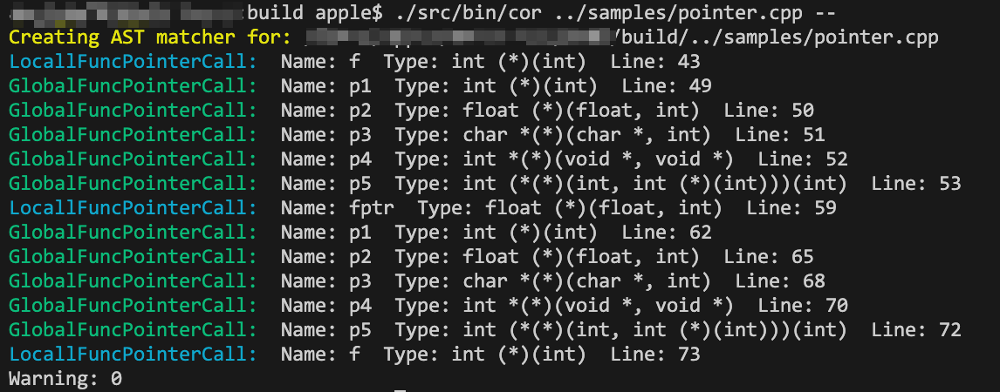

# COR
COR is a funCtion pOinter Recognizer.
This project is designed to locate global function pointers in a program, which can be hijacked to gain control flow after obtaining arbitrary read/write access.

The project identifies global function pointers that are commonly used by the program. For instance, `valgrind` uses "vex_printf" to print some information, and the function pointer is found by tracing back to "vex_printf -> vex_vprintf -> (*vex_log_bytes)( myprintf_buf, n_myprintf_buf );"

It should be noted that the identified function pointers stored in the BSS segment as a global variable are better. Function pointers stored in local variables or function parameters are not easily exploitable.

This project aims to provide an efficient way of identifying global function pointers that can be used to exploit programs, and help developers to identify and patch vulnerabilities.

## Build
```
mkdir build && cd build && cmake -DCMAKE_BUILD_TYPE=Debug ..
make -j16 cor
```

## Usage
```
build $ ./src/bin/cor ../samples/pointer.cpp --
```




## Other methods

Here are some useful cli tools.

### clang-query
Clang-query allows you to write queries to search for specific code patterns, extract information about variables, functions, and classes, and perform transformations on the Clang AST.
[README.md](query/README.md)

### Codeql
Codeql CLI APIs provides a command-line interface for interacting with CodeQL databases and running queries. I found that these APIs can be easily used to identify function pointers and work well.
[README.md](ql/README.md)