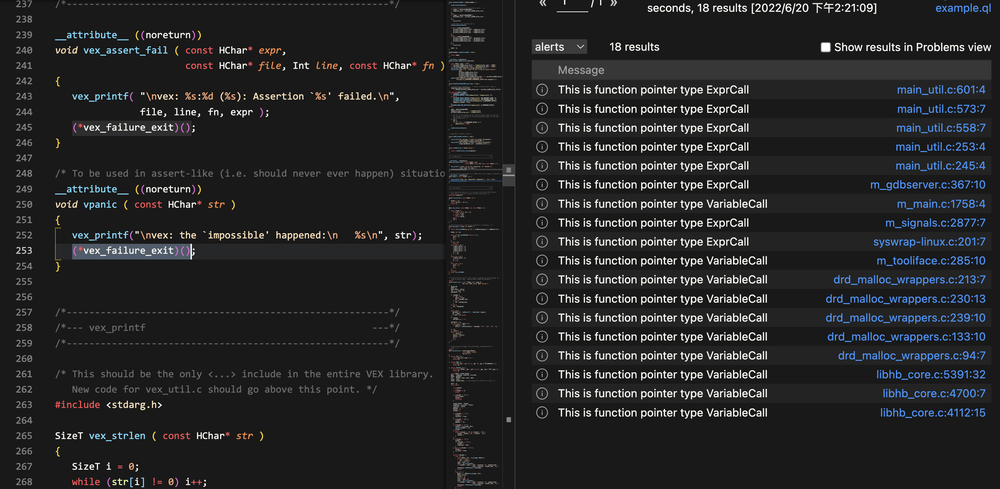

Query1. VariableCall

```
c.(VariableCall).getVariable().getAPrimaryQlClass()
```
The majority of the results obtained are Field (Structures that may be located in the heap/bss, and can also contain function pointers) (not currently considered), with a small portion of GlobalVariable (important), LocalVariable (excluded), Parameter (excluded) 


Improved version:
```
import cpp
from ExprCall c
where
 c.(VariableCall).getVariable() instanceof GlobalVariable
select c, "This is function pointer type "+c.(VariableCall).getVariable().getAPrimaryQlClass()
```


Query2. not VariableCall

```
not c instanceof VariableCall 
select c, "This is function pointer type "
```

The majority of the results obtained are VariableAccess (important), FunctionAccess (excluded) and a small portion of ValueFieldAccess (not currently considered) are also present. EQExpr (too few to consider) is also excluded.

Improved version:
```
select c, "This is function pointer type "+c.getExpr().getAChild().(VariableAccess).getTarget().getAPrimaryQlClass()
```
 
The majority of the results obtained are LocalVariable (excluded), Parameter (excluded), Field (not currently considered), and GlobalVariables (important).

Final version:
```
import cpp
from ExprCall c
where
  //funcptr(1);
  c.(VariableCall).getVariable() instanceof GlobalVariable
  or
  //(*funcptr)(1);
  (not c instanceof VariableCall and c.getExpr().getAChild().(VariableAccess).getTarget() instanceof GlobalVariable)
select c, "This is function pointer type "+c.getAPrimaryQlClass()
```

Works well:



[Todo] global function pointers in Field or Parameter needs data flow analysis.